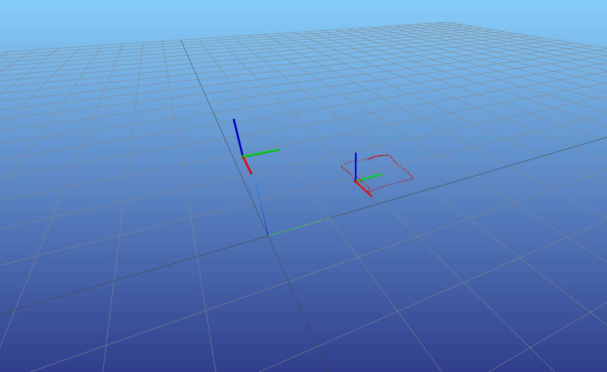

# OptiTrack NatNet Usage

Receive Rigid Body pose (x, y, z + quaternion) on a remote computer using the NatNet SDK from OptiTrack Motive.

---

# Purpose

Obtain real-time OptiTrack Rigid Body coordinates on a remote computer.

Output Format：

- Position  
  - x
  - y
  - z
- Orientation (Quaternion)
  - qx
  - qy
  - qz
  - qw

---

# Usage

pyton3.10 -m venv venv

source venv/bin/activate

pip install numpy meshcat    
    
git clone https://github.com/YuehChuan/optitrack_motive.git 

python optitrack_to_robot.py    

python viz_optitrack.py
# Documents：

OptiTrack-Natnet Usage

https://docs.google.com/document/d/1bIvBxaY1PBottD7-rZyusXsz39Y3lMO8/edit?usp=sharing&ouid=111562241696057241699&rtpof=true&sd=true

